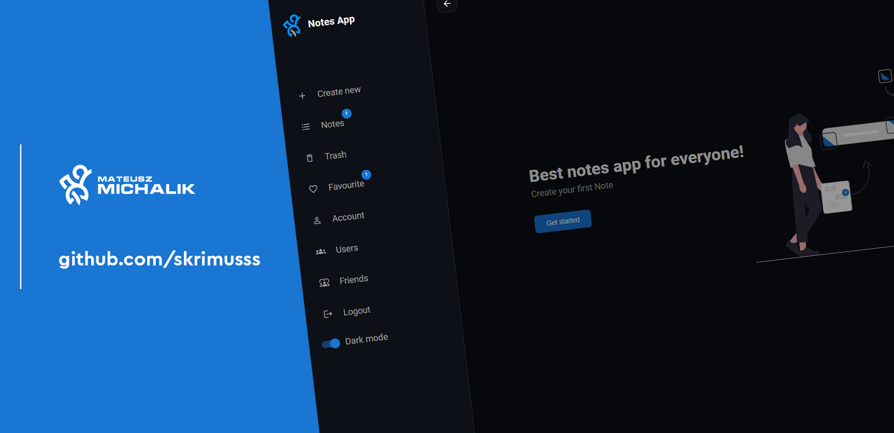

<h4 align="center">Notes App - Modern app for noting</h4>
 
<h3 align='center'>Live 💻</h3>

<a target='_blank' href='https://mati-1.github.io/Notes-App'>⭐ Notes App ⭐</a>

 
<h3 align='center'>About project 🔍</h3> 

That's modern app for creating notes with user login/register system. Application introducing new hot features with futuristic design.

 
<h3 align='center'>Time spent on this project ⌛️</h3> 

 
<h2 align='center'>Technologies used 💎</h2> 

React 🔹 Typescript 🔹 Context API 🔹 React Hook Form 🔹 Framer motion 🔹 SCSS 🔹 Firebase

 
